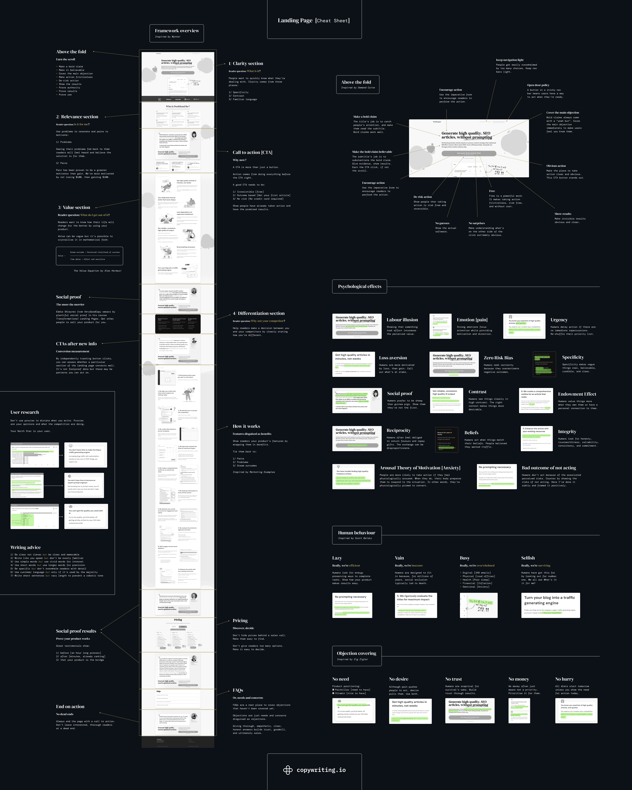

# nordcode

Moin! Welcome to our small WIP agency.

This is the home of  our utility packages, design system and useful projects, that we rely on for our daily work.
Feel free to check them out or use them, if they're useful to you.

## Useful Links

### Compliance

- [Google Docs Summary](https://docs.google.com/document/d/1LhYXryfkwYOnvDD6_VSpwSHV-rpmbwH9kcCQla4ZKck/edit?usp=sharing)
- [Awesome GDPR](https://github.com/oppoverbakke/awesome-gdpr)
- [Awesome GDPR](https://github.com/erichard/awesome-gdpr)

### Security

- [Awesome Security](https://github.com/sindresorhus/awesome#security)
- [Awesome AppSec](https://github.com/paragonie/awesome-appsec?tab=readme-ov-file#tools)
    - [SSL Server Test](https://www.ssllabs.com/ssltest/)
    - [Security Headers](https://securityheaders.com/)
    - [CSP Header Analyzer](https://report-uri.com/home/analyse)
    - [Clickjacker](https://clickjacker.io/)

### Inspiration

- <https://www.domesiconcepthouse.cz/>
- <https://tailwindcss.com/>
- <https://www.earlydog.com/>
- <https://make.studio/>
- <https://titansinkware.com/>
- <https://www.createwithplay.com/>
- <https://clay.global/> *
- <https://wise.com/de/>
- <https://stripe.com/sessions> *
- <https://resend.com/> *
- <https://www.samesame.studio/>
- <https://focuslab.agency/> *
- <https://www.mozilla.org/en-US/firefox/new/>
- <https://www.pandadoc.com/> brutalist
- <https://www.freefaces.gallery/> simple
- <https://magnet.co/> simple
- <https://unikorns.agency/> * simple
- <https://www.getivy.io/> simple
- <https://www.halo-lab.com/> modern unique *
- <https://meshbg-1xcve0hlq-chasedavis.vercel.app/0.615577921549203> three.js generator
- <https://www.asc-csa.gc.ca/eng/multimedia/search/image/14713> earth
- https://www.andy.works/ playful
- https://www.getpliant.com/de/ * clean
- https://www.klimate.co/ * clean, techie
- https://kraa.io/kraa/examples/echolibrary * clean, black/white

### Icons

- https://remixicon.com/
- https://tabler-icons.io/

## Resources

